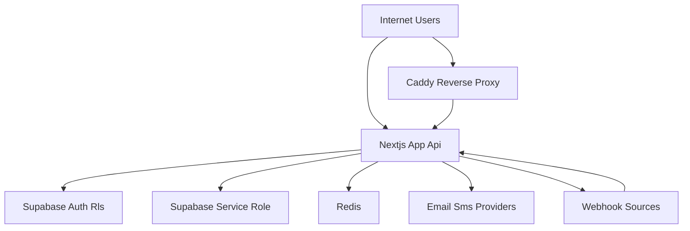

## Executive summary
Lebensordner handles highly sensitive PII and personal documents with a strong security baseline (Supabase auth, RLS, tokenized sharing, 2FA, rate-limits, structured logs), but several design and implementation gaps create material risk of unauthorized document access. The top risk theme is trust-boundary bypass through token and relationship flows (invitation acceptance plus trusted-person linking) combined with broad service-role reads. The most critical near-term exposure is that invitation acceptance can overwrite invite email and later auto-link access by email, enabling takeover of trusted-person access if invite tokens leak.

## Scope and assumptions
In-scope paths:
- src/app/api
- src/lib/auth
- src/lib/security
- src/lib/consent
- src/lib/supabase
- supabase/migrations and supabase/migration_*.sql
- deploy/docker-compose.yml, deploy/Caddyfile, deploy/supabase/kong.yml
- next.config.js, middleware.ts

Out-of-scope:
- Third-party managed internals (Stripe, Supabase internals, Twilio, Resend)
- CI runner internals and GitHub org policy beyond repo configuration
- Live penetration test against production host

Assumptions (updated with user answers):
- Internet exposed app/API.
- Token-only invitation acceptance is intentional business behavior.
- /api/feedback should not be public anonymous.
- App stores very sensitive personal and document data; confidentiality is primary.
- Threat priorities assume single-tenant app ownership with many user accounts.

Open questions that materially affect risk ranking:
- Is trusted_persons.access_level intended to enforce hard authorization (emergency-only timing/scope) or only UX labeling?
- Is there already upstream WAF/rate-limiting at Caddy/edge for public POST endpoints?

## System model
### Primary components
- Browser client (Next.js App Router frontend).
- Next.js API routes handling auth, sharing, vault, family access, admin, webhooks.
- Supabase Auth, PostgREST, Storage, Postgres with RLS and service-role bypass for server operations.
- Redis for rate limiting and pending 2FA challenges.
- External providers: Stripe, Resend, Twilio, Cloudflare Turnstile, Telegram/Grafana webhooks.
- Caddy reverse proxy and internal Docker network.

### Data flows and trust boundaries
- Internet -> Next.js routes (`/api/*`) over HTTPS.
  - Data: credentials, tokens, PII, document metadata, upload payloads.
  - Channel: HTTPS.
  - Guarantees: route-level auth checks, selected rate limits, optional captcha.
  - Validation: per-route JSON/form checks; inconsistent across endpoints.

- Next.js API -> Supabase (anon/session client) over internal network.
  - Data: user-scoped DB reads/writes, auth session checks.
  - Channel: HTTPS/internal HTTP depending on deployment.
  - Guarantees: Supabase JWT + RLS.
  - Validation: DB policies + endpoint checks.

- Next.js API -> Supabase (service-role client) over internal network.
  - Data: privileged reads/writes, storage downloads, admin operations.
  - Channel: internal network.
  - Guarantees: bearer service-role secret.
  - Validation: entirely application-enforced authorization.

- Next.js API -> Redis.
  - Data: rate-limit counters, pending-auth challenges (access/refresh tokens in challenge record).
  - Channel: Redis TCP with password.
  - Guarantees: network isolation + redis auth.
  - Validation: key-based access in app only.

- Next.js API -> external providers (Stripe, Resend, Twilio, Turnstile, Telegram, GitHub).
  - Data: billing events, email/SMS PII, bot/webhook payloads.
  - Channel: HTTPS.
  - Guarantees: webhook signature/secret checks on some routes.
  - Validation: variable, route-specific.

#### Diagram

## Assets and security objectives
| Asset | Why it matters | Security objective (C/I/A) |
| --- | --- | --- |
| Personal documents and medical records | Highest user harm/regulatory impact on leak | C, I |
| Vault key material (`user_vault_keys`, wrapped keys) | Enables decryption workflows; key misuse breaks confidentiality model | C, I |
| Trusted-person relationships and share tokens | Governs delegated access to sensitive documents | C, I |
| Download/invitation bearer tokens | Anyone with token may gain read access depending on route logic | C |
| Service-role secret and admin API paths | Full bypass of RLS and broad data read/write | C, I, A |
| Auth credentials, reset/2FA flow artifacts | Account takeover risk | C, I |
| Audit/security logs | Detection and forensic integrity | I, A |
| Subscription/role state (`profiles.role`, Stripe fields) | Controls admin and feature-gated access | I |

## Attacker model
### Capabilities
- Remote unauthenticated attacker can call public routes and token endpoints.
- Authenticated low-privilege user can probe object IDs, relationship flows, and sharing APIs.
- Attacker with leaked link/token (email compromise, referer leak, client compromise) can replay token flows.
- Bot actor can automate endpoint abuse (feedback/email, invitation attempts, token probing).

### Non-capabilities
- No direct shell on server and no direct DB credentials by default.
- No assumed compromise of Stripe/Supabase/Twilio/Resend control planes.
- No assumed break of strong crypto primitives (AES-GCM/AES-KW/PBKDF2).

## Entry points and attack surfaces
| Surface | How reached | Trust boundary | Notes | Evidence (repo path / symbol) |
| --- | --- | --- | --- | --- |
| `/api/invitation` GET/POST | Public token URL | Internet -> API -> service-role DB | Token-only accept/decline, updates invitation row by token | `src/app/api/invitation/route.ts` |
| `/api/trusted-person/link` | Authenticated user | User session -> API -> service-role fallback | Links accepted invites by email (`ilike`) | `src/app/api/trusted-person/link/route.ts` |
| `/api/family/view`, `/api/family/download`, `/api/family/view/bytes` | Authenticated trusted person | User session -> API -> service-role documents | Access level read but not enforced as hard gate | `src/app/api/family/*/route.ts` |
| `/api/download-link/[token]*` | Public bearer token | Internet -> API -> service-role docs/storage | Token checks exist; high-value bearer surface | `src/app/api/download-link/**/route.ts` |
| `/api/documents/upload` | Authenticated multipart upload | User session -> API -> storage/db | File type/size checks and rate limiting present | `src/app/api/documents/upload/route.ts` |
| `/api/profile`, `/api/notfall`, `/api/export/gdpr-data` | Authenticated sensitive data APIs | User session -> API -> encrypted fields | Server-side decrypt path for profile/notfall export | `src/app/api/profile/route.ts`, `src/app/api/notfall/route.ts`, `src/app/api/export/gdpr-data/route.ts` |
| `/api/admin/*` | Admin session only | User session -> API -> service-role DB | role guard + service-role access | `src/lib/auth/guards.ts`, `src/app/api/admin/*` |
| `/api/feedback` | Public POST | Internet -> API -> service-role DB + email | No auth/captcha/rate limit; abuseable | `src/app/api/feedback/route.ts` |
| Webhooks (`stripe`, `telegram-bot`, `grafana-alert`) | Provider callbacks | External systems -> API | Secret/signature checks present | `src/app/api/stripe/webhook/route.ts`, `src/app/api/webhooks/*` |
| Cron routes (`/api/cron/*`) | Bearer or x-vercel-cron | Scheduler -> API -> service-role operations | Mixed auth model; x-vercel-cron accepted | `src/app/api/cron/*/route.ts` |

## Top abuse paths
1. Trusted-person takeover via leaked invite token
- Attacker gets invite token.
- Calls `POST /api/invitation` with `action=accept` and attacker-controlled email.
- Registers account with that email.
- Calls `/api/trusted-person/link` to auto-link accepted invitation by email.
- Reads victim docs via family routes.

2. Bearer token replay on download/view links
- Attacker obtains download/view token from email leak or browser history.
- Calls `/api/download-link/[token]/metadata` and stream endpoints.
- Retrieves signed URLs / stream content until expiry.
- Exfiltrates documents.

3. Delegation overreach via missing `access_level` authorization
- Trusted person accepted with restricted expected scope.
- API checks relationship but not strict access-level semantics.
- Trusted person accesses full owner document set.
- Confidentiality violation beyond owner intent.

4. Public feedback abuse -> email flood and operational DoS
- Bot posts high-volume requests to `/api/feedback`.
- DB fills and support email spam volume rises.
- Incident response burden and alert fatigue.

5. Service-role misuse bug in any high-privilege route
- Authenticated attacker finds one missing ownership check in service-role endpoint.
- Endpoint bypasses RLS and returns/modifies cross-user data.
- Cross-account data breach at scale.

6. Invite token brute-force/probing over time
- Attacker performs distributed token probing against invitation and download endpoints.
- Finds valid token due to leakage + repeated probing + limited telemetry.
- Accesses target relationship metadata or documents.

7. XSS impact amplification due to permissive CSP
- Any XSS gadget lands in app.
- `unsafe-inline` / `unsafe-eval` broadens exploitability.
- Session/token abuse and sensitive data exfiltration.

## Threat model table
| Threat ID | Threat source | Prerequisites | Threat action | Impact | Impacted assets | Existing controls (evidence) | Gaps | Recommended mitigations | Detection ideas | Likelihood | Impact severity | Priority |
| --- | --- | --- | --- | --- | --- | --- | --- | --- | --- | --- | --- | --- |
| TM-001 | External attacker with leaked invite token | Possession of invitation token | Accept invite with attacker email, then auto-link via `/api/trusted-person/link` | Unauthorized trusted-person access to victim documents | Trusted-person relationships, documents | Token required; invite status checks (`src/app/api/invitation/route.ts`) | Accept flow permits email overwrite; link-by-email with service-role fallback | Keep token-only UX but lock invite email immutable; require email OTP for accept; consume token once; remove service-role fallback or constrain by invitation ID and signed proof | Alert on invitation email change at accept, unusual link-after-accept chains, geo/device anomalies | High | High | critical |
| TM-002 | Authenticated trusted person exceeding intended scope | Any accepted trusted-person link | Access all owner docs despite intended access-level restriction | Over-broad confidential data disclosure | Documents, medical records | Relationship checks (`src/app/api/family/*`) | `access_level` appears informational, not hard auth gate | Enforce access-level policy in all family routes and SQL policies; add explicit deny paths and tests per access level | Audit event for denied access-level checks; alert on unexpected full-export by restricted role | Medium | High | high |
| TM-003 | Internet bot actor | Public access to `/api/feedback` | High-rate spam inserts + outbound email flood | Availability degradation, operational incident, data quality poisoning | Feedback DB, support channels | Basic input presence checks (`src/app/api/feedback/route.ts`) | No auth, captcha, or rate-limit | Require auth or Turnstile, add fail-closed IP limits, queue + abuse scoring, sanitize subject/body length and content | Alert on feedback volume spikes, same IP/email burst patterns | High | Medium | high |
| TM-004 | Token replay attacker | Leaked download/view token | Replay token before expiry to fetch metadata/streams | Document exposure to unintended party | Documents, sharing tokens | Token entropy and expiry; HMAC stream token checks (`src/app/api/download-link/[token]/view/stream/route.ts`) | Bearer model still high-risk; no secondary recipient verification | Optional recipient challenge (email OTP) for sensitive links, short TTL defaults, stricter one-time semantics for view tokens where possible | Monitor repeated token use from changing IP/user-agent | Medium | High | high |
| TM-005 | App logic bug in service-role path | Any missing owner check in a route using service role | Cross-user read/write by abusing endpoint logic | Cross-tenant confidentiality/integrity compromise | All user data under service-role reach | Many routes do ownership checks; admin guard exists (`src/lib/auth/guards.ts`) | Large service-role attack surface increases chance of single-check failure | Reduce service-role use, move authZ to DB RPC with validated args, add central ownership assertion helpers and property tests | Alert on service-role queries touching atypical user_ids per request | Medium | High | high |
| TM-006 | Script injection attacker | XSS entry point exists | Execute script under permissive CSP to steal session/tokens | Account takeover/data exfiltration | Sessions, PII | Some security headers in `next.config.js` | CSP allows `unsafe-inline` and `unsafe-eval` | Move to nonce-based CSP, remove unsafe-eval, Trusted Types where feasible | Browser CSP violation reports and anomaly telemetry | Low | High | medium |
| TM-007 | Auth abuse attacker | Credential stuffing scale | Exhaust auth endpoints/race lockout bypass attempts | Account compromise pressure and support load | Accounts, auth state | Login/reset rate-limits, captcha threshold, lockout, 2FA challenge (`src/app/api/auth/login/route.ts`) | Redis failures logged but fallback behavior varies by endpoint; some console logging remains in security libs | Ensure fail-closed for high-risk auth paths uniformly; replace raw console logs with structured logging | Alert on lockout spikes, captcha-failure bursts, pending-auth challenge anomalies | Medium | Medium | medium |

## Criticality calibration
Critical for this repo means direct unauthorized access to personal documents/medical data or cross-user service-role abuse.
- Examples: invite-token takeover chain (TM-001), unauthenticated or weakly bound token route exposing documents.

High means realistic abuse with major confidentiality or integrity impact but with stronger prerequisites.
- Examples: access-level bypass in family flows (TM-002), replay of leaked download/view token (TM-004), single service-role authZ bug (TM-005).

Medium means meaningful security degradation that needs remediation but is less likely or requires additional exploit conditions.
- Examples: permissive CSP amplification (TM-006), auth abuse pressure despite existing controls (TM-007).

Low means limited impact or highly constrained exploitability.
- Examples: noisy health endpoint probing, minor metadata leakage with no document content access.

## Focus paths for security review
| Path | Why it matters | Related Threat IDs |
| --- | --- | --- |
| src/app/api/invitation/route.ts | Token acceptance and invitation mutation logic controls delegated trust | TM-001 |
| src/app/api/trusted-person/link/route.ts | Auto-link by email and service-role fallback can finalize unauthorized linkage | TM-001, TM-005 |
| src/app/api/family/view/route.ts | Trusted-person read path with broad document query and access-level ambiguity | TM-002 |
| src/app/api/family/download/route.ts | Bulk document export for trusted persons; high exfiltration impact | TM-002, TM-004 |
| src/app/api/family/view/bytes/route.ts | Direct file bytes endpoint; ensure parity with stream token protections | TM-002 |
| src/app/api/download-link/create/route.ts | Token issuance, ownership checks, wrapped key association | TM-004 |
| src/app/api/download-link/[token]/view/route.ts | Public token metadata + stream token generation | TM-004 |
| src/app/api/download-link/[token]/view/stream/route.ts | HMAC token verification and document stream gating | TM-004 |
| src/app/api/download-link/[token]/route.ts | Token-based ZIP download and token-use mutation | TM-004 |
| src/app/api/feedback/route.ts | Public write and email trigger abuse surface | TM-003 |
| src/lib/auth/resolve-authenticated-user.ts | Mixed auth source resolution can affect trust assumptions across APIs | TM-005 |
| src/lib/auth/guards.ts | Admin gate for high-privilege routes | TM-005 |
| src/app/api/admin/users/route.ts | Service-role full-user listing, sensitive admin data plane | TM-005 |
| src/app/api/admin/stats/route.ts | Service-role aggregated access path | TM-005 |
| src/app/api/admin/users/role/route.ts | Privilege change operation | TM-005 |
| src/app/api/profile/route.ts | Server-side decrypt/encrypt of sensitive profile fields | TM-005 |
| src/app/api/notfall/route.ts | Health/emergency data path with consent checks and encrypted fields | TM-005 |
| src/lib/consent/manager.ts | Service-role consent reads/writes and fallback logic | TM-005, TM-007 |
| src/lib/security/rate-limit.ts | Core enforcement model for auth and abuse controls | TM-003, TM-007 |
| src/lib/security/pending-auth.ts | Holds pending access/refresh tokens in Redis during 2FA | TM-007 |
| src/lib/redis/client.ts | Redis connectivity and error behavior affects fail-open/closed posture | TM-007 |
| next.config.js | CSP and browser-side containment posture | TM-006 |
| supabase/migrations/20260226000004_fix_e2ee_and_storage_rls_grants.sql | RLS/grants baseline for key tables and storage paths | TM-005 |
| supabase/migration_038_rpc_security.sql | Security-definer RPC hardening pattern | TM-005 |
| deploy/docker-compose.yml | Secret distribution and internal trust boundaries | TM-005 |

## Quality check
- Covered discovered entry points including token/share/family/admin/auth/webhook/cron/feedback surfaces.
- Mapped each major trust boundary into at least one abuse path or threat.
- Separated runtime app risks from deployment/config context; CI tooling not mixed into core runtime threats.
- Incorporated user clarifications: token-only invite intentional, feedback not public anonymous.
- Remaining assumptions and open questions are explicit (especially access_level semantics).

## Additional findings (ownership-map + second-pass review)
The following findings were identified after running the security ownership map and re-reviewing code paths to avoid duplicating TM-001..TM-007.

### Ownership risk summary (`security-ownership-map`)
- Hidden owner concentration:
  - `Chris (araea2@protonmail.com)` controls ~96% of auth-tagged code.
- Bus factor hotspots (`auth`, bus factor 1) include:
  - `src/app/api/auth/login/route.ts`
  - `src/app/api/auth/2fa/route.ts`
  - `src/app/api/auth/password-reset/request/route.ts`
  - `src/lib/auth/resolve-authenticated-user.ts`
  - `src/lib/auth/guards.ts`
- Security implication:
  - Critical auth controls are single-owner dominated, increasing regressions and delayed incident response risk under maintainer unavailability.

### New threat entries
| Threat ID | Threat source | Prerequisites | Threat action | Impact | Impacted assets | Existing controls (evidence) | Gaps | Recommended mitigations | Detection ideas | Likelihood | Impact severity | Priority |
| --- | --- | --- | --- | --- | --- | --- | --- | --- | --- | --- | --- | --- |
| TM-008 | External attacker spoofing scheduler headers | Internet access to cron endpoints | Send requests with `x-vercel-cron: 1` to execute cron jobs without `CRON_SECRET` | Mass email/SMS spam, queue churn, unintended data processing | User contact channels, trust, availability | `CRON_SECRET` check exists | Cron routes accept spoofable header as alternate auth in self-hosted deployment (`src/app/api/cron/send-reminders/route.ts`, `src/app/api/cron/process-email-queue/route.ts`, `src/app/api/cron/send-upgrade-emails/route.ts`) | Remove `x-vercel-cron` fallback in self-hosted mode; require HMAC/Bearer only; add IP allowlist at Caddy for cron routes | Alert on cron endpoint calls missing bearer auth; anomaly alerts on reminder/upgrade email volume | High | High | critical |
| TM-009 | Internet attacker abusing feedback API integrity | Public access to feedback endpoint | Submit feedback with forged `userId` to impersonate another user in support workflows | Operational fraud, misattribution during support/security triage | Support process integrity, auditability | Input required-field checks only (`src/app/api/feedback/route.ts`) | `userId` trusted from client and stored with service-role write; no auth/captcha/rate-limit | Derive `userId` from authenticated session only; ignore client `userId`; require auth or Turnstile + rate limit | Alert on feedback rows where `user_id` mismatches authenticated session; detect high-volume anonymous submissions | High | Medium | high |
| TM-010 | Attacker with DB/log access to token table | Read access to `download_tokens` rows | Reuse plaintext tokens directly to access shared documents before expiry | Immediate confidentiality breach of shared docs | Download links, shared document contents | Token entropy and expiry checks at runtime | Tokens appear stored/queried in plaintext (`.eq('token', token)` in multiple download-link routes) | Store only token hash (e.g., SHA-256), compare hashed input, rotate existing tokens; keep only hash prefix in logs | Alert on token validation failures/successes by hash prefix and unusual replay | Low | High | medium |
| TM-011 | Internal resilience/maintainer risk | Team single-point ownership in auth code | Delayed fixes/reviews in auth-critical changes; increased chance of unnoticed auth regressions | Elevated long-term security regression probability | Authentication and account-security controls | Existing tests present; no ownership guardrails | Security-critical auth files have bus factor ~1 from ownership map output | Add mandatory CODEOWNERS + required reviewers for `src/app/api/auth/**` and `src/lib/auth/**`; cross-train second maintainer; add release gate for auth file changes | Track review diversity metric for auth/security paths over time | Medium | Medium | medium |

## Implementation status (2026-03-06)
- TM-001: Mitigated in code.
  - Invitation acceptance no longer overwrites stored invitation email.
  - Accept action requires provided email to match the originally invited email.
  - Invitations are now single-use by status (`pending` only); repeated accept/decline attempts return conflict.
  - Trusted-person linking now uses user-scoped linking only (service-role fallback removed).
  - Evidence: `src/app/api/invitation/route.ts`, `src/app/api/trusted-person/link/route.ts`.
- TM-002: Mitigated in code.
  - Enforced `access_level` authorization across family endpoints:
    - `view` allowed for `immediate` and `emergency`.
    - `download` allowed for `immediate` only.
    - `after_confirmation` denied by default.
  - Evidence: `src/lib/security/trusted-person-access.ts`, `src/app/api/family/view/route.ts`, `src/app/api/family/view/stream/route.ts`, `src/app/api/family/view/bytes/route.ts`, `src/app/api/family/download/route.ts`.
- TM-004: Mitigated in code.
  - Added recipient step-up verification flow for download links via challenge endpoint and signed HttpOnly verification cookie.
  - Enforced recipient verification gate on token access routes (`metadata`, `view`, `view/stream`, `download`, `mark-used`).
  - Added bounded view-link reuse guard (`access_count` threshold) and replay telemetry updates (`access_count`, `last_accessed_at`, `last_accessed_ip`).
  - Evidence: `src/app/api/download-link/[token]/challenge/route.ts`, `src/lib/security/download-link-recipient-challenge.ts`, `src/app/api/download-link/[token]/metadata/route.ts`, `src/app/api/download-link/[token]/view/route.ts`, `src/app/api/download-link/[token]/view/stream/route.ts`, `src/app/api/download-link/[token]/route.ts`, `src/app/api/download-link/[token]/mark-used/route.ts`, `src/app/herunterladen/[token]/page.tsx`, `src/app/herunterladen/[token]/view/page.tsx`.
- TM-008: Mitigated in code.
  - Cron routes now require `Authorization: Bearer <CRON_SECRET>` only.
  - Removed `x-vercel-cron` fallback acceptance and replaced unauthorized `console.warn` with structured warn logs.
  - Evidence: `src/app/api/cron/send-reminders/route.ts`, `src/app/api/cron/process-email-queue/route.ts`, `src/app/api/cron/send-upgrade-emails/route.ts`.
- TM-009: Mitigated in code.
  - `POST /api/feedback` now requires authenticated user, derives `user_id` from session, and ignores client-spoofed `userId`.
  - Added fail-closed per-IP and per-user rate limits.
  - Evidence: `src/app/api/feedback/route.ts`.
- TM-010: Mitigated in code + migration.
  - Added hash-at-rest token model (`token_hash`) and switched all download-link lookups to SHA-256 hash comparison.
  - Added migration to backfill hashes, create unique index, and null out plaintext `token` values.
  - Evidence: `supabase/migrations/20260306000000_download_tokens_hash_at_rest.sql`, `src/lib/security/download-token.ts`, `src/app/api/download-link/**/route.ts`.
- TM-011: Accepted risk for now (solo-dev constraint).
  - No implementation change applied yet; keep on roadmap for future contributor onboarding and review redundancy.
- TM-006: Partially mitigated in code.
  - Removed `unsafe-eval` from CSP `script-src`.
  - Remaining gap: `unsafe-inline` still present and should be replaced with nonce/hash-based policy over time.
  - Evidence: `next.config.js`.
- TM-007: Mitigated for current identified gaps.
  - Replaced remaining security-library raw console logging with structured logs in Redis/security utilities.
  - Added fail-closed rate-limit behavior to invite/download-link creation routes.
  - Evidence: `src/lib/redis/client.ts`, `src/lib/security/auth-lockout.ts`, `src/lib/security/device-detection.ts`, `src/app/api/trusted-person/invite/route.ts`, `src/app/api/download-link/create/route.ts`.
- TM-005: Mitigated for targeted family access paths.
  - Added centralized trusted-person service-role authorization guard and routed family endpoints through the shared guard logic.
  - Reduced duplicate ad-hoc authorization logic in sensitive family routes.
  - Evidence: `src/lib/security/trusted-person-guard.ts`, `src/app/api/family/view/route.ts`, `src/app/api/family/download/route.ts`, `src/app/api/family/view/stream/route.ts`, `src/app/api/family/view/bytes/route.ts`.
