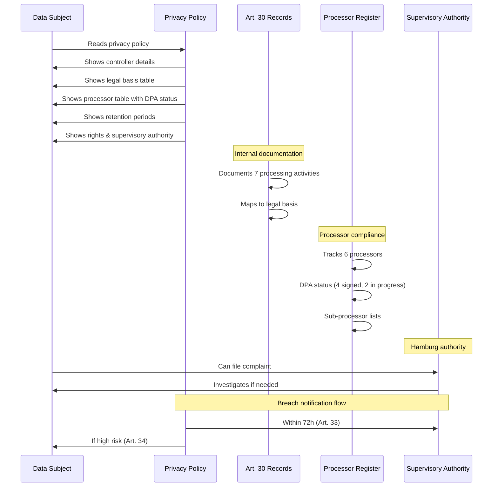

# Legal Documentation Index - Lebensordner Digital

**Last Updated:** 14. Februar 2026

## Overview
- This directory contains all legal and compliance documentation for Lebensordner Digital
- Controller: Christof Boermel, Lehmbrookweg 2, 22159 Hamburg, Deutschland
- Contact: matbo@matsbusiness.co.site, +49 172 7553584

## GDPR Compliance Documents
- **Art. 30 Records of Processing Activities** (`art-30-records-of-processing.md`)
  Last Updated: 14. Februar 2026
  Version: 1.0
  Description: Verzeichnis aller 7 Verarbeitungstätigkeiten gem. Art. 30 DSGVO
- **Breach Notification Procedures** (`breach-notification-procedures.md`)
  Last Updated: 14. Februar 2026
  Version: 1.0
  Description: Verfahren zur Meldung von Datenschutzverletzungen (Art. 33-34 DSGVO)
- **DPO Assessment** (`dpo-assessment.md`)
  Last Updated: 14. Februar 2026
  Version: 1.0
  Description: Bewertung der Datenschutzbeauftragten-Pflicht (Art. 37 DSGVO, BDSG §38)
- **Processor Register** (`processor-register.md`)
  Last Updated: 14. Februar 2026
  Version: 1.0
  Description: Auftragsverarbeiter-Register mit DPA-Status (Art. 28 DSGVO)

## Technical Documentation
- **Audit Log Retention Policy** (referenced in privacy policy)
  Retention: 90 days
  Anonymization: Upon account deletion (user_id removed)
  Legal Basis: Art. 6 Abs. 1 lit. f DSGVO (berechtigtes Interesse)

## Public-Facing Legal Pages
- **Privacy Policy** (`file:src/app/datenschutz/page.tsx`)
  Version: v2.0.0
  Last Updated: 14. Februar 2026
  URL: https://lebensordner.org/datenschutz
- **Terms of Service** (`file:src/app/agb/page.tsx`)
  Last Updated: Januar 2025
  URL: https://lebensordner.org/agb
- **Impressum** (`file:src/app/impressum/page.tsx`)
  Last Updated: Januar 2025
  URL: https://lebensordner.org/impressum

## Supervisory Authority
- Name: Der Hamburgische Beauftragte für Datenschutz und Informationsfreiheit
- Address: Ludwig-Erhard-Straße 22, 20459 Hamburg
- Email: mailbox@datenschutz.hamburg.de
- Phone: +49 40 428 54-4040
- Website: https://datenschutz-hamburg.de

## Review Schedule
- Privacy Policy: Review bei Änderungen der Verarbeitungstätigkeiten oder Rechtsänderungen
- Art. 30 Records: Jährliche Überprüfung (nächste: 14. Februar 2027)
- DPO Assessment: Jährliche Überprüfung oder bei Erreichen von 1000+ Nutzern / 20+ Mitarbeitern
- Processor Register: Jährliche Überprüfung, sofort bei neuen Prozessoren

## Legal Disclaimer
- Diese Dokumentation wurde nach bestem Wissen und unter Berücksichtigung der DSGVO erstellt
- Eine anwaltliche Prüfung wird empfohlen, sobald finanziell machbar
- Bei Fragen: matbo@matsbusiness.co.site

## Version History
- v1.0 (14. Februar 2026): Initiale GDPR-Compliance-Dokumentation erstellt

## Visual Overview

