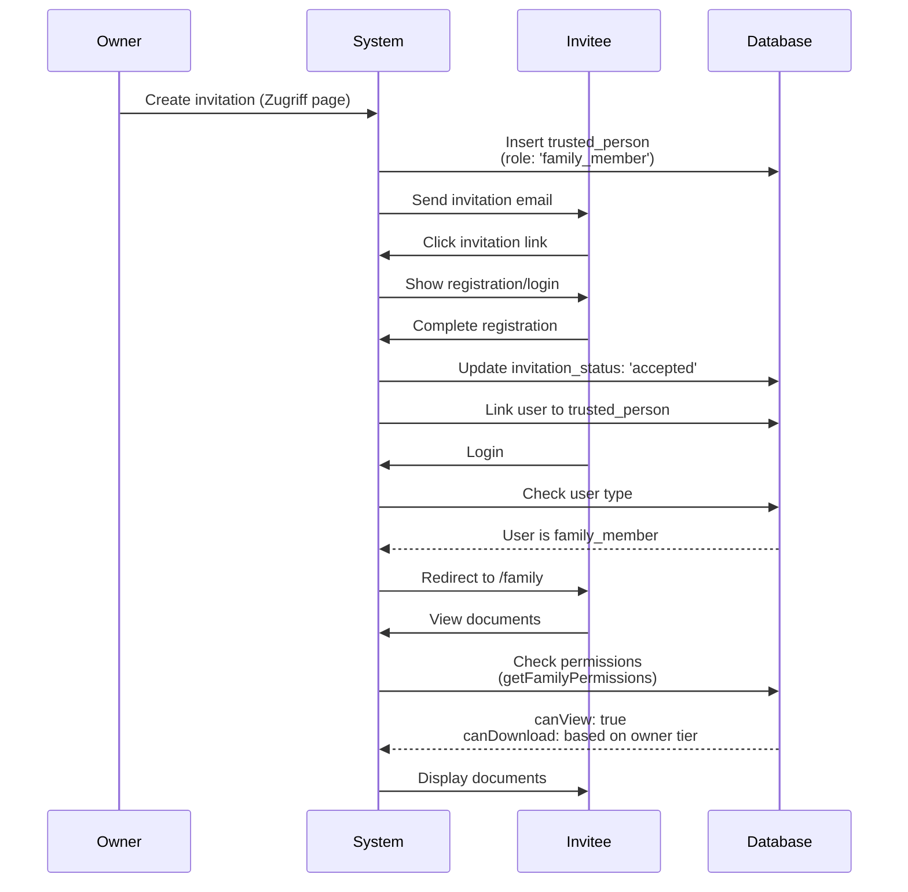
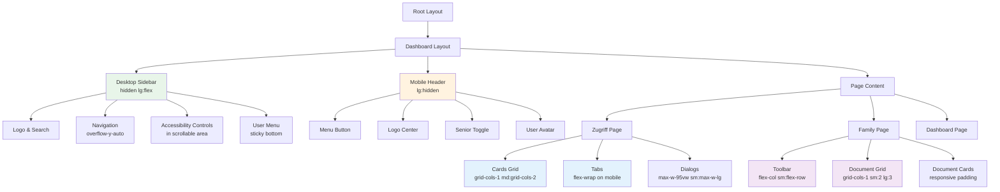

I have created the following plan after thorough exploration and analysis of the codebase. Follow the below plan verbatim. Trust the files and references. Do not re-verify what's written in the plan. Explore only when absolutely necessary. First implement all the proposed file changes and then I'll review all the changes together at the end.

## Observations

The codebase has two critical issues: (1) **Permission logic restricts invitees** - only users with `role: 'family_member'` can view documents, but the invitation flow doesn't set this role, causing access denial. (2) **No user type differentiation** - the system doesn't distinguish between owners and family members at login, leading to incorrect dashboard routing. Additionally, **mobile responsiveness is incomplete** across multiple components, particularly in senior mode where larger touch targets and fonts cause overflow issues in the navbar, tabs, and complex layouts.

## Approach

The plan addresses both issues systematically: First, fix the permission system by ensuring invited users receive the correct `role: 'family_member'` during invitation and acceptance, then update permission checks to properly validate family member access. Second, implement user type detection at the routing level to redirect family members to their appropriate dashboard. For mobile responsiveness, apply a comprehensive refactoring using proper breakpoints, flexible layouts, and touch-optimized components across all affected pages, with special attention to senior mode compatibility.

---

## Implementation Plan

### **Part 1: Fix Invitee Document Access & Dashboard Issues**

#### **1.1 Update Invitation Flow to Set Family Member Role**

**File: `file:src/app/(dashboard)/zugriff/page.tsx`**

- Locate the invitation creation logic (around line 222-236)
- When inserting a new trusted person, add `role: 'family_member'` to the insert statement
- Update the insert to include:
  ```
  role: 'family_member',
  access_level: 'immediate',
  access_delay_hours: 0,
  ```
- This ensures all invited users are marked as family members who can view documents

**File: `file:src/app/api/invitation/route.ts`**

- Review the invitation acceptance logic
- Ensure that when an invitation is accepted, the `role` field is set to `'family_member'` if not already set
- Update the trusted person record to set `role: 'family_member'` and `invitation_status: 'accepted'`

#### **1.2 Update Permission Checks to Support Family Members**

**File: `file:src/lib/permissions/family-permissions.ts`**

- Review the `getFamilyRelationship` function (lines 52-74)
- The current query filters by `role: 'family_member'` at line 157
- Update the permission check logic:
  - Accept both `role: 'family_member'` AND `role: null` (for legacy invitations)
  - Ensure `invitation_status: 'accepted'` and `is_active: true` are the primary filters
  - Only deny access if the relationship doesn't exist or is inactive
- Update line 157 condition from:
  ```
  if (!relationship || relationship.role !== 'family_member')
  ```
  to:
  ```
  if (!relationship)
  ```
- This allows any accepted and active trusted person to view documents, regardless of role

#### **1.3 Implement User Type Detection and Routing**

**File: `file:src/app/(dashboard)/layout.tsx`**

- Add server-side logic to detect if the logged-in user is an owner or family member
- Check if user has a profile in the `profiles` table (owner) or only exists in `trusted_persons` as `linked_user_id` (family member)
- For family members:
  - Redirect from `/dashboard` to `/family` page
  - Hide owner-specific navigation items (Dokumente, Notfall, Zugriff, Export, Abo)
  - Show only family-relevant items (Familien-Übersicht, Einstellungen)

**File: `file:src/components/layout/dashboard-nav.tsx`**

- Add a prop `userType: 'owner' | 'family_member'` to the `DashboardNavProps` interface
- Filter the navigation array based on `userType`:
  - For `'owner'`: show all navigation items
  - For `'family_member'`: show only `/family`, `/vp-dashboard`, `/einstellungen`, `/feedback`
- Update the navigation rendering logic (lines 141-162) to conditionally render based on user type

**File: `file:src/app/(dashboard)/dashboard/page.tsx`**

- Add a check at the beginning to detect if user is a family member
- If user has no profile but exists as `linked_user_id` in `trusted_persons`, redirect to `/family`
- This prevents family members from accessing the owner dashboard

#### **1.4 Update Family Dashboard to Handle Multiple Owners**

**File: `file:src/app/(family)/family/page.tsx`**

- Currently assumes single owner connection (line 70-76)
- Update to handle multiple owner connections:
  - Query all accepted trusted person relationships where `linked_user_id` equals current user
  - If multiple owners, show a selection interface
  - If single owner, proceed with current logic
  - If no owners, show the existing "no connection" message

**File: `file:src/app/(family)/family/family-documents-client.tsx`**

- Add owner selection dropdown if multiple owners exist
- Update the component to accept an array of owners and allow switching between them
- Maintain current document viewing and download functionality per owner

---

### **Part 2: Mobile Responsiveness Fixes**

#### **2.1 Fix Navbar Overflow in Senior Mode**

**File: `file:src/components/layout/dashboard-nav.tsx`**

**Desktop Sidebar (lines 112-309):**
- The accessibility controls section (lines 200-260) is inside the scrollable area, which is correct
- Ensure the scrollable container has proper overflow handling:
  - Add `overflow-y-auto` and `overflow-x-hidden` to prevent horizontal scroll
  - Add `scrollbar-gutter: stable` to prevent layout shift
- Senior mode toggle button (lines 201-222):
  - Ensure minimum touch target of 44px height (currently 48px with padding, good)
  - Add responsive padding: `px-3 py-2.5 sm:px-4 sm:py-3`

**Mobile Header (lines 312-371):**
- The senior mode toggle (lines 331-342) needs larger touch target in senior mode
- Update button classes to include:
  ```
  className={cn(
    "p-2.5 rounded-lg transition-colors min-w-[44px] min-h-[44px]",
    seniorMode && "p-3 min-w-[56px] min-h-[56px]",
    ...
  )}
  ```
- Ensure the mobile header doesn't overflow by using `flex-wrap` and proper spacing

**Mobile Menu Overlay (lines 374-447):**
- Add responsive width: change `max-w-xs` to `max-w-[85vw] sm:max-w-sm`
- Ensure navigation items have proper touch targets in senior mode
- Update navigation link classes (lines 393-407) to include:
  ```
  className={cn(
    'flex items-center gap-3 px-4 py-3 rounded-lg text-base font-medium',
    seniorMode && 'py-4 text-lg min-h-[56px]',
    ...
  )}
  ```

#### **2.2 Fix Zugriff & Familie Tab Overflow**

**File: `file:src/app/(dashboard)/zugriff/page.tsx`**

**Two Options Cards (lines 326-405):**
- Change grid from `grid md:grid-cols-2` to `grid grid-cols-1 md:grid-cols-2`
- Add responsive gap: `gap-4 sm:gap-6`
- Ensure cards stack properly on mobile

**Trusted Persons List (lines 430-601):**
- The card content (lines 458-540) has complex flex layouts
- Update to use responsive flex direction:
  ```
  className="flex flex-col sm:flex-row items-start sm:items-center justify-between gap-4"
  ```
- Action buttons container (lines 489-538):
  - Wrap in responsive container
  - Stack vertically on mobile: `flex flex-col sm:flex-row gap-2`
  - Ensure buttons have minimum 44px touch targets

**Tabs Component (lines 441-599):**
- The `TabsList` component needs mobile optimization
- Update in `file:src/components/ui/tabs.tsx`

**Dialogs (lines 618-820):**
- Download Link Dialog (lines 618-728):
  - Add responsive max-width: `max-w-[95vw] sm:max-w-lg`
  - Ensure form inputs are full width on mobile
  - Stack dialog footer buttons vertically on mobile
- Add/Edit Person Dialog (lines 731-820):
  - Same responsive adjustments as above
  - Ensure form fields stack properly with adequate spacing

#### **2.3 Fix Tabs Component Overflow**

**File: `file:src/components/ui/tabs.tsx`**

**TabsList (lines 9-22):**
- Change from `inline-flex` to responsive flex
- Update className:
  ```
  className={cn(
    "flex flex-wrap sm:inline-flex h-auto sm:h-12 items-center justify-start sm:justify-center rounded-lg bg-warmgray-100 p-1 text-warmgray-500 gap-1",
    className
  )}
  ```
- This allows tabs to wrap on mobile instead of overflowing

**TabsTrigger (lines 24-37):**
- Ensure minimum touch target size
- Update className:
  ```
  className={cn(
    "inline-flex items-center justify-center whitespace-nowrap rounded-md px-3 py-2.5 sm:px-4 sm:py-2 text-sm sm:text-base font-medium min-h-[44px] ring-offset-background transition-all focus-visible:outline-none focus-visible:ring-2 focus-visible:ring-ring focus-visible:ring-offset-2 disabled:pointer-events-none disabled:opacity-50 data-[state=active]:bg-white data-[state=active]:text-sage-700 data-[state=active]:shadow-sm",
    className
  )}
  ```

#### **2.4 Fix Family Documents Client Overflow**

**File: `file:src/app/(family)/family/family-documents-client.tsx`**

**Toolbar (lines 308-373):**
- Currently uses `flex flex-wrap` which is good
- Update responsive classes:
  ```
  className="sticky top-4 z-30 flex flex-col sm:flex-row items-stretch sm:items-center justify-between gap-4 rounded-2xl border border-warmgray-200 bg-white/95 p-4 shadow-lg backdrop-blur sm:p-6"
  ```
- Ensure buttons stack vertically on mobile with full width
- Update button classes to include `w-full sm:w-auto`

**Selection Controls (lines 331-343):**
- Ensure "Select All" checkbox and label are properly sized
- Update checkbox to have larger touch target in senior mode:
  ```
  className="h-6 w-6 border-2 min-h-[44px] min-w-[44px] sm:h-6 sm:w-6 sm:min-h-0 sm:min-w-0"
  ```

**Document Grid (lines 413-426):**
- Currently uses `grid grid-cols-1 sm:grid-cols-2 lg:grid-cols-3`
- This is correct, but ensure gap is responsive: `gap-6 sm:gap-8`

**Document Card (lines 118-233):**
- Card header (lines 125-167):
  - Ensure checkbox positioning works on mobile
  - Update padding: `p-4 sm:p-6 sm:p-8`
- Card content buttons (lines 171-231):
  - Ensure buttons are full width on mobile
  - Update button classes: `w-full min-h-[48px] sm:min-h-[56px]`
  - Increase touch target in senior mode

#### **2.5 Fix Dashboard Content Overflow**

**File: `file:src/components/dashboard/dashboard-content.tsx`**

**Senior Mode View (lines 83-210):**
- Main action buttons (lines 102-128):
  - Already using `min-h-[4rem]` which is good
  - Ensure proper text wrapping with `whitespace-normal`
  - Add responsive padding: `py-3 px-4 sm:px-6`

**Normal View (lines 214-404):**
- Organization Status Card (lines 227-289):
  - Grid layout (lines 250-286) uses `grid-cols-1 md:grid-cols-3`
  - Add responsive gap: `gap-4 sm:gap-6`
- Quick Actions Grid (lines 300-327):
  - Currently `grid-cols-1 sm:grid-cols-3`
  - Ensure cards don't overflow on small screens
  - Add responsive padding to category cards
- Document Categories Grid (lines 387-400):
  - Currently `grid-cols-2 md:grid-cols-4 lg:grid-cols-7`
  - This might be too many columns on tablet
  - Update to: `grid-cols-2 sm:grid-cols-3 md:grid-cols-4 lg:grid-cols-7`
  - Ensure minimum card height is maintained: `min-h-[100px] sm:min-h-[120px]`

#### **2.6 Fix VP Dashboard Overflow**

**File: `file:src/app/(dashboard)/vp-dashboard/client.tsx`**

**Container (line 110):**
- Add responsive padding: `px-4 sm:px-6 lg:px-0`
- Ensure max-width doesn't cause overflow

**Member Cards (lines 151-196, 213-238):**
- Update flex direction to be responsive:
  ```
  className="flex flex-col sm:flex-row sm:items-center justify-between gap-4 sm:gap-6"
  ```
- Member info section (lines 154-174):
  - Ensure email truncates properly on mobile
  - Add `truncate` class to email span
- Download button (lines 176-192):
  - Make full width on mobile: `w-full sm:w-auto sm:min-w-[180px]`
  - Ensure minimum touch target: `min-h-[48px] sm:min-h-[56px]`

#### **2.7 Global CSS Updates**

**File: `file:src/app/globals.css`**

Add responsive utilities and senior mode overrides:

```css
/* Mobile-first breakpoints */
@media (max-width: 640px) {
  /* Prevent horizontal overflow */
  body {
    overflow-x: hidden;
  }
  
  /* Ensure dialogs fit on mobile */
  [role="dialog"] {
    max-width: 95vw !important;
  }
}

/* Senior mode touch targets */
.senior-mode button,
.senior-mode a,
.senior-mode [role="button"] {
  min-height: 56px;
  min-width: 56px;
}

/* Senior mode font sizes */
.senior-mode {
  font-size: 1.125rem; /* 18px */
  line-height: 1.75;
}

.senior-mode h1 {
  font-size: 2.25rem; /* 36px */
}

.senior-mode h2 {
  font-size: 1.875rem; /* 30px */
}

/* Prevent tab overflow */
[role="tablist"] {
  overflow-x: auto;
  -webkit-overflow-scrolling: touch;
  scrollbar-width: thin;
}
```

---

### **Testing Checklist**

After implementation, verify:

**Permission & Access:**
1. ✓ Create new invitation and verify `role: 'family_member'` is set
2. ✓ Accept invitation and verify document access works
3. ✓ Test document viewing for family members
4. ✓ Test document downloading based on owner's subscription tier
5. ✓ Verify legacy invitations (with `role: null`) still work

**Dashboard Routing:**
1. ✓ Owner login redirects to `/dashboard`
2. ✓ Family member login redirects to `/family`
3. ✓ Navigation shows correct items for each user type
4. ✓ Family members cannot access owner-only pages

**Mobile Responsiveness:**
1. ✓ Test on iPhone SE (375px width) - smallest common mobile
2. ✓ Test on iPad (768px width) - tablet portrait
3. ✓ Test on iPad landscape (1024px width)
4. ✓ Verify no horizontal scrollbars on any page
5. ✓ Test all touch targets are minimum 44px (normal) / 56px (senior mode)
6. ✓ Test senior mode on all screen sizes
7. ✓ Verify navbar doesn't overflow in senior mode
8. ✓ Verify tabs wrap properly on mobile
9. ✓ Verify Zugriff & Familie page layouts correctly
10. ✓ Verify family documents page layouts correctly
11. ✓ Verify all dialogs fit on mobile screens
12. ✓ Test form inputs and buttons are easily tappable

---

### **Sequence Diagram: Invitation & Access Flow**



---

### **Component Hierarchy: Mobile Responsive Layout**

